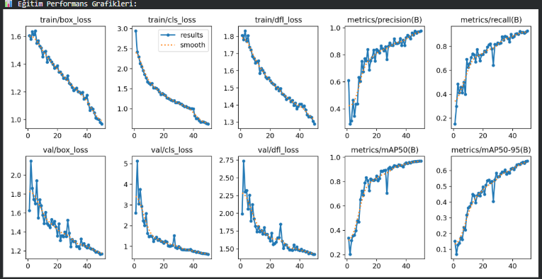
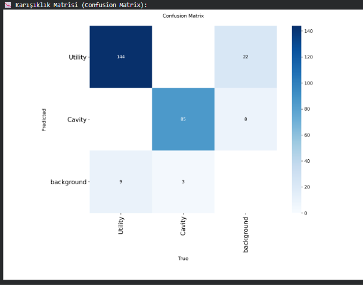

# 📡 GPR-YOLO: Subsurface Object Detection with Deep Learning

> **Automated detection of underground utilities and voids using Ground Penetrating Radar (GPR) imagery and YOLOv8.**


---

## 📖 Project Overview
Ground Penetrating Radar (GPR) interpretation is a complex task that requires expert knowledge. Manual analysis is time-consuming and prone to human error due to noise and clutter in B-scan images.

This project aims to **minimize human error** by automating the detection process. We utilized the **YOLOv8** architecture to identify and classify subsurface anomalies into two critical categories:

* 🔴 **Utility:** Pipes, cables, and buried objects (Hyperbolic reflections).
* 🔵 **Cavity:** Underground voids, tunnels, and holes.

---

## 📊 Performance & Results

Our model was trained on **2,000+ real-world GPR B-scans** (sourced from Mendeley Data) for 50 epochs.

| Metric | Score | Description |
| :--- | :--- | :--- |
| **mAP50** | **97.1%** | Overall detection accuracy |
| **Precision** | **95%** | Reliability of positive detections |
| **Recall** | **93%** | Ability to find all existing objects |

### 1. Training Performance
The graphs below demonstrate the model's learning curve. Both box loss and classification loss decreased significantly, while mAP scores reached ~97%.


*(Fig 1: Training metrics over 50 epochs)*

### 2. Confusion Matrix
The confusion matrix shows the model's high success rate in distinguishing between "Utility" and "Cavity" classes, with minimal background confusion.



---

## 👁️ Visual Demos
Here is an example of the model's prediction on unseen test data. The system successfully bounds the hyperbolic reflection of a buried pipe.


*(Fig 2: Left: Original B-Scan | Right: YOLOv8 Prediction)*

---

## 🛠️ Methodology & Tech Stack

* **Preprocessing:**
    * Resizing to 640x640 via Bilinear Interpolation.
    * Pixel normalization [0, 1].
    * Channel mapping (Grayscale to RGB).
* **Feature Extraction:**
    * Convolutional Neural Networks (CNN) with 3x3 and 5x5 kernels to detect edges and hyperbolic shapes.
* **Model Architecture:** Ultralytics YOLOv8 (Nano).

---

## 📂 Installation & Usage

This project is optimized for **Google Colab**.

1.  **Clone the repository:**
    ```bash
    git clone [https://github.com/KULLANICI_ADIN/GPR-YOLO-Project.git](https://github.com/KULLANICI_ADIN/GPR-YOLO-Project.git)
    ```
2.  **Upload the Notebook:**
    Upload `GPR_System.ipynb` to your Google Drive or open directly in Colab.
3.  **Install Dependencies:**
    ```python
    !pip install ultralytics
    ```
4.  **Run Training:**
    ```python
    from ultralytics import YOLO
    model = YOLO('yolov8n.pt')
    model.train(data='data.yaml', epochs=50)
    ```

---

## 👥 Contributors

This project was developed as a term project for the **Image Processing (LBML374)** course at **Istanbul Arel University**.

* **Gülbahar Doğan**
* **Mustafa Efe Aydın**
* **Department:** Computer Engineering

---

## 📄 License
This project is for educational purposes. The dataset is sourced from [Mendeley Data](https://data.mendeley.com/).
